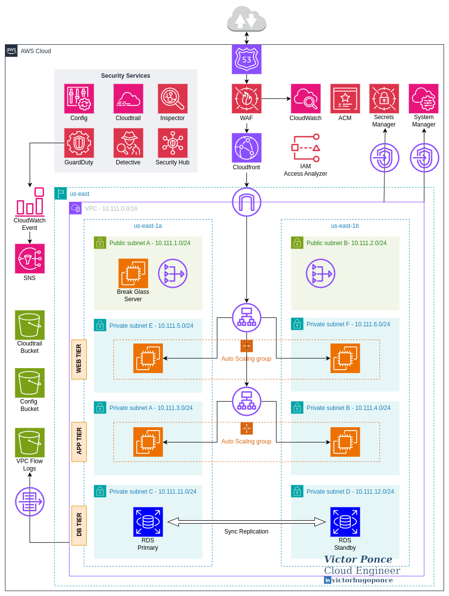
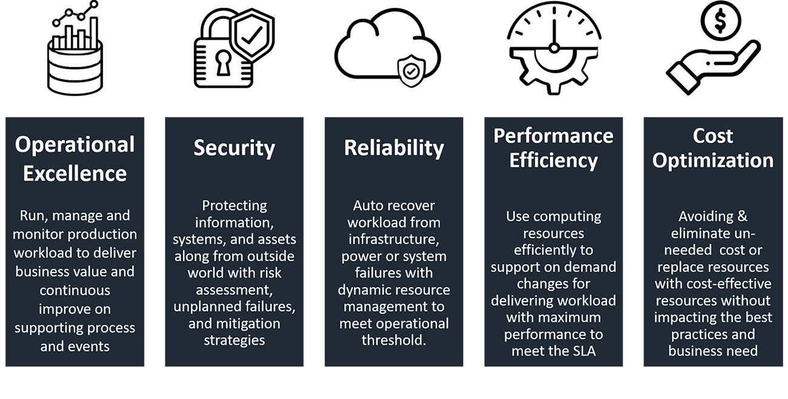

# Project: Securing a 3-tier application
**Author:** Victor Ponce | **Contact:** [Linkedin](https://www.linkedin.com/in/victorhugoponce)

## 1. Overview

This project demonstrates a secure, production-ready AWS architecture built with Terraform.
The goal is to showcase my security engineering skills by integrating defense-in-depth controls across networking, identity, monitoring, and application layers.

The base solution consists of a 3-tier application (web, app, database) with strong security measures: private subnets, strict security groups, centralized logging, threat detection, edge and layer 7 protection,  automated compliance checks, among others, alligned with the AWS Well-Architected framework. 

## 2. Architecture Diagram

<em>(img. 1 – Architecture Diagram)</em>

## 3. Infrastructure

The core infrastructure where the main security solutions will revolve around consists of a 3-tier architecture: Web tier, App tier and Database Tier. Each tier has strict security rules to control traffic flowing to and between them. Below is the detail of the components deployed per tier. 

| Tier               | Subnets / AZs                                                  | Resources                                                                        | Access                                 |
| ------------------ | -------------------------------------------------------------- | -------------------------------------------------------------------------------- | ------------------------------------- |
| **Web Tier**       | Private Subnet E (us-east-1a) Private Subnet F (us-east-1b) | Auto Scaling Group Internet-facing Application Load Balancer                  | Only receives traffic from CloudFront |
| **App Tier**       | Private Subnet A (us-east-1a) Private Subnet B (us-east-1b) | Auto Scaling Group Internal Application Load Balancer                         | Communicates with Web + DB            |
| **Database Tier**  | Private Subnet C (us-east-1a) Private Subnet D (us-east-1b) | RDS for MySQL                                                                      | Encrypted, no public access           |
| **Public Subnets** | Public Subnet A (us-east-1a) Public Subnet B (us-east-1b)   | Break Glass Server (EC2) NAT Gateway (us-east-1a) NAT Gateway (us-east-1b) | NAT for private subnets               |

<em>(Table 1 – 3-tier Infrastructure)</em>

The Web and App tiers are placed in two different private subnets, across two availability zones for redundancy. Both tiers have outgoing internet access through the NAT Gateways, which is required for updates, software installation and patching.

The Web tier serves its content through CloudFront and acts as a bridge between the users and the app tier, receiving all requests from the user through its web interface and interacting with the app to fulfill the requests. 
The Web tier scales on-demand thanks to the implementation of an Auto Scale Group, which triggers on CPU metrics. An Internet facing Application Load Balancer will distribute the traffic to the app across two availability zones. 

The App Tier receives and processes the requests from the Web Tier through an Internal Application Load Balancer and interacts directly with the Database tier. This tier also runs on an Auto Scale Group, which triggers on CPU metrics.

The next tables detail the logic behind the scaling, based on the following CloudWatch Metric Alarms: 

| **CloudWatch Metric Alarm (WEB ASG)** |           |
| ------------------------------------- | --------- |
| **Parameter**                         | **Value** |
| Metric                                | CPU       |
| Threshold                             | 70        |
| Evaluation Periods                    | 2         |
| Period (seconds)                      | 30        |

<em>(Table 2 – CloudWatch metric alarm for WEB ASG)</em>

| **CloudWatch Metric Alarm (APP ASG)** |           |
| ------------------------------------- | --------- |
| **Parameter**                         | **Value** |
| Metric                                | CPU       |
| Threshold                             | 60        |
| Evaluation Periods                    | 3         |
| Period (seconds)                      | 30        |

<em>(Table 3 – CloudWatch metric alarm for App ASG)</em>

There’s an RDS database with MySQL in the Web tier, with synchronous replication to a secondary availability zone, in case of disaster. The database will only interact with the App tier, which is enforced by Security Groups. 

## 4. Workflow

Users access the App through a public domain configured in Route 53 which goes to a CloudFront distribution to serve the requests at edge. Additionally CloudFront is protected by WAF ACLs. An Internet facing Application Load Balancer is CloudFront’s origin and receives all non-cached requests which are equally distributed to the Web tier (Auto Scaling Group). The App tier processes the Web’s requests and reads/writes to the DB.

## 5. Network Security

All tiers are placed in private subnets and communication between tiers is restricted by Security Groups. 
The Web tier has direct communication to the Internet-facing Application Load Balancer (lba) and the App tier. The ALB only accepts traffic from CloudFront. The App tier communicates directly with the Web and DB tiers, while the Database tier has access to the App tier only, as detailed in the following table: 

| Security Group      | Direction | Source / Destination  | Protocol | Port(s) | Description                                            |
| ------------------- | --------- | --------------------- | -------- | ------- | ------------------------------------------------------ |
| **web**             | Ingress   | SG: lba               | TCP      | 80, 443 | Allow HTTP/HTTPS from Load Balancer                    |
| web                 | Ingress   | SG: app               | TCP      | 443     | Allow HTTPS from App tier                              |
| web                 | Ingress   | SG: break_glass       | TCP      | 22      | Allow                                                  |
| web                 | Egress    | 0.0.0.0/0             | ALL      | ALL     | Allow all outbound                                     |
| **lba**             | Ingress   | com.amazonaws.global cloudfront.origin-facing             | TCP      | 443     | AWS-managed prefix list for Amazon CloudFront    |
| lba                 | Egress    | 0.0.0.0/0             | ALL      | ALL     | Allow all outbound                                     |
| **app**             | Ingress   | SG: web               | TCP      | 80, 443 | Allow HTTP/HTTPS from Web tier                         |
| app                 | Ingress   | SG: break_glass       | TCP      | 22      | Allow                                                  |
| app                 | Egress    | 0.0.0.0/0             | ALL      | ALL     | Allow all outbound                                     |
| **lbb**             | Ingress   | SG: web               | TCP      | 80, 443 | Allow HTTP/HTTPS from Web tier                         |
| lbb                 | Egress    | 0.0.0.0/0             | ALL      | ALL     | Allow all outbound                                     |
| **db**              | Ingress   | SG: app               | TCP      | 3306    | Allow MySQL from App tier                              |
| db                  | Ingress   | SG: break_glass       | TCP      | 3306    | Allow MySQL from Break Glass server                    |
| **ssm**             | Ingress   | SG: app               | TCP      | 443     | Allow HTTPS from App tier                              |
| ssm                 | Ingress   | SG: web               | TCP      | 443     | Allow HTTPS from Web tier                              |
| ssm                 | Ingress   | SG: break_glass       | TCP      | 443     | Allow HTTPS from Break Glass server                    |
| ssm                 | Egress    | 0.0.0.0/0             | ALL      | ALL     | Allow all outbound                                     |
| **secrets_manager** | Ingress   | SG: app               | TCP      | 443     | Allow HTTPS from App tier                              |
| secrets_manager     | Ingress   | SG: break_glass       | TCP      | 443     | Allow HTTPS from Break Glass server                    |
| secrets_manager     | Egress    | 0.0.0.0/0             | ALL      | ALL     | Allow all outbound                                     |
| **break_glass**     | Ingress   | CIDR: var.on-prem-vpn | TCP      | 22      | Allow SSH from On-Prem VPN                             |
| break_glass         | Egress    | CIDR: var.on-prem-vpn | ALL      | ALL     | Allow outbound to On-Prem VPN                          |

<em>(Table 4 – Security Groups)</em>

Three VPC endpoints allow secure communication to AWS Systems Manager for the Web and App tiers, this ensures that all traffic going through the Session Manager remains internal. 
Another VPC endpoint for AWS Secrets Manager allows the App tier to interact with the service securely. 

A CloudFront distribution caches the Web, avoiding having direct communication between the user/Web tier. The distribution is protected by WAF with the following rules: 

| Priority | Rule Name                             | Type               | Action                        | Description                                                                           |
| -------- | ------------------------------------- | ------------------ | ----------------------------- | ------------------------------------------------------------------------------------- |
| 1        | AWSManagedRulesCommonRuleSet          | Managed Rule Group | Default                       | Baseline protections against common threats |
| 2        | RateLimitPerIP                        | Rate-Based Rule    | Block                         | Blocks IPs exceeding 800 requests in 5 minutes (DDoS/brute-force protection)          |
| 3        | AWSManagedRulesSQLiRuleSet            | Managed Rule Group | Default                       | Detects SQL injection attempts                                                        |
| 4        | AWSManagedRulesAmazonIpReputationList | Managed Rule Group | Default                       | Detects/block requests from known malicious IPs (AWS threat intelligence)               |

<em>(Table 5 – WAF rules)</em>

A Break-glass EC2 instance provides emergency access to all our servers in the Web and App tiers, as well as to the VPC endpoints, in case of an unexpected malfunction of SSM Session Manager or misconfiguration. The instance allows ingress traffic on port 22 (SSH) only from the on-premise VPN IP range.

## 6. Identity and Access 

Three roles were necessary to allow EC2 instances (Web/App tiers) to interact with SSM Session Manager and Secrets Manager (App tier), as well a role to allow EventBridge to publish to SNS events. 

| Role Name                        | Trusted Service        | Policies Attached                                                                                                             | Purpose                                                                          |
| -------------------------------- | ---------------------- | ----------------------------------------------------------------------------------------------------------------------------- | -------------------------------------------------------------------------------- |
| ssm_role                       | ec2.amazonaws.com    | AmazonSSMManagedInstanceCore                                                                                                | Enables EC2 instances to use AWS Systems Manager (SSM).                          |
| ssm-secrets-manager            | ec2.amazonaws.com    | AmazonSSMManagedInstanceCore, custom policy (secretsmanager:GetSecretValue, secretsmanager:DescribeSecret on DB secret) | Allows EC2 app tier to use SSM and fetch DB secrets from Secrets Manager.    |
| eventbridge_guardduty_sns_role | events.amazonaws.com | Inline policy (sns:Publish on sns_guardduty_finding topic)                                                                | Allows EventBridge to publish events the GuardDuty findings to an SNS topic. |

<em>(Table 6 – Roles)</em>

AWS Secrets Manager is used to store the DB credentials which will be used by the App. A VPC Endpoint ensures private traffic to the secrets. 

## 7. Login and Compliance

**IAM Access Analyzer:** Used for access analysis, policy checks, and policy generation. External and Unused analyses are enabled in my solution to identify external access to our resources and unused permissions, which will help to adjust last privilege. 

**AWS Cloudtrail:** Records the API calls made in the account and saves them in an S3 bucket. 

**AWS Config:** Records all configuration and configuration changes for our resources and also saves the information in its own S3 bucket.

**VPC Flow Logs:** Records all the traffic inside our VPC which we can use for troubleshooting. 

**Amazon Inspector:** Will scan our EC2 instances (from our two Auto Scaling Groups in the Web/App tiers) for known vulnerabilities. 

**Amazon Detective:** Is a threat detection service that detects malicious behavior & anomalies.

## 8. Monitoring and Response

**CloudWatch Metrics:** Four cloudwatch metrics are created with the deployment of the WAF resource, and will allow us to follow the WAF’s Managed and Rate-based rules (as described in the Network Security section).

**GuardDuty findings:** Is configured to notify us by email from CRITICAL findings by integrating it with EventBridge and SNS.

**Security Hub:** Centralized view of security & compliance findings that will allow us to generate compliance dashboards for security frameworks like CIS, PCI DSS, NIST or integrate SIEM systems like Splunk. 

## 9. AWS Well-Achitected Framework

I designed this solution using the [AWS Well-Architected Framework](https://docs.aws.amazon.com/wellarchitected/latest/framework/welcome.html) best practices as reference. The framework is based on the following six pillars:

<em>(img. 2 – AWS Well-Architected Framework Pillars)</em>

In the following table I mapped how each service and architectural decision of this solution fits into each pillar (Sustainability pillar not shown):

| Pillar                        | Key Practices / Controls                                                                                                                                                                                                                                                                                                                                                                                                                                                                                                                                                                               |
| ----------------------------- | ------------------------------------------------------------------------------------------------------------------------------------------------------------------------------------------------------------------------------------------------------------------------------------------------------------------------------------------------------------------------------------------------------------------------------------------------------------------------------------------------------------------------------------------------------------------------------------------------------ |
| **Operational Excellence** | - Infrastructure as Code (Terraform): repeatable, auditable deployments - CloudWatch alarms and scaling policies: proactive monitoring of system health - Automated email notifications for GuardDuty findings - Break-glass access instance: operational fallback for incident response                                                                                                                                                                                                                                                                            |
| **Security**               | - Network Segmentation: 3-tier architecture with private subnets for Web/App/DB - Least Privilege Security Groups: granular ingress/egress rules per tier - Identity Management: IAM roles, instance profiles, custom IAM policies - Secrets Manager: no hardcoded DB credentials, with versioning - VPC Endpoints: private access to SSM & Secrets Manager - Detection & Monitoring: CloudTrail, Config, GuardDuty, Inspector, Detective, Security Hub - Edge Protection: CloudFront + WAF + ACM for TLS - Logging & Auditing: VPC Flow Logs, CloudTrail logs |
| **Reliability**            | - Multi-AZ subnets: high availability across zones - ASGs with scaling policies: auto-healing + demand-based scaling - Two ALBs (web + app tiers): redundant entry points - Route53: managed DNS with health checks - NAT Gateways in multiple AZs: resilient outbound access                                                                                                                                                                                                                                                                                                              |
| **Performance Efficiency** | - Auto Scaling: scales web/app tiers on demand - CloudFront CDN: improves latency by caching content closer to users - Separation of tiers: allows independent scaling (web vs. app vs. DB)                                                                                                                                                                                                                                                                                                                                                                                                      |
| **Cost Optimization**      | - Auto Scaling Policies: prevent overprovisioning - VPC Endpoints: reduce NAT Gateway data processing costs - Flow logs & central logging in S3: cost-efficient long-term storage - Random string naming for buckets: avoids resource collisions and re-use infra efficiently                                                                                                                                                                                                                                                                                                                 |
| **Sustainability**         | - Auto Scaling + right-sizing: avoids running idle resources - CloudFront caching: reduces repeated backend calls, lowering resource usage - Separation of environments: allows infra to be spun up/down as needed                                                                                                                                                                                                                                                                                                                                                                               |

<em>(Table 6 – AWS Well-Achitected Framework Implementation)</em>

                                                   

## 10. Conclusion

This project demonstrates a well-architected, defense-in-depth security design for a 3-tier application on AWS, implemented fully with Terraform. By integrating network segmentation, least privilege IAM, secrets management, logging, anomaly detection, and edge protection, the architecture is resilient, secure, and aligned with AWS best practices.
